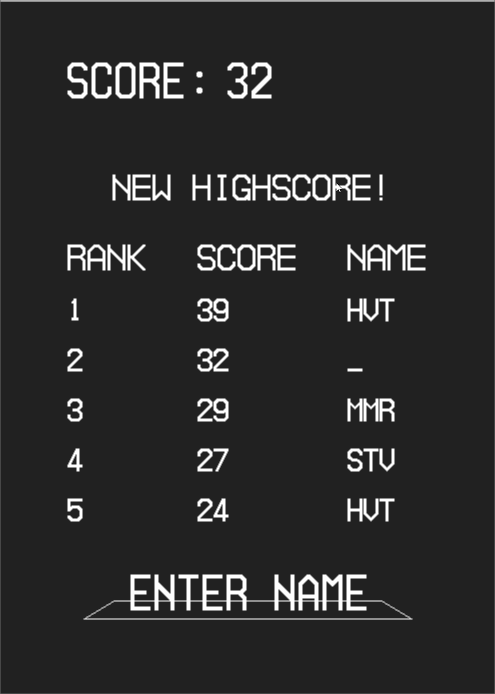

# SmashBrickGame
A simple brick breaker style game, completed as the final project for an introductory course on C++/OpenGL development

  

## Gameplay
- The user aims and shoots a stream of balls, launched from the bottom of the screen
- At each new level, a randomly filled row of blocks enters the top of the screen
- Each block has a number of lives randomly assigned to it, with increasing difficulty as the game progresses
- When a ball collides with a block, that block decreases by one life
- When a block gets to zero lives it disappears
- If a block reaches the bottom row (hasn't been destroyed by bringing it down to zero lives), the game is over
- The objective is to play as long as possible
- The white circles are powerups: hit one, and the number of balls in the stream increases
- The rabbit in the top right corner is a speedup option: if a level is taking a long time, click on the rabbit to speed up the bouncing animations and end the level faster

## Features
- Blocks change color based on a colormap and how many lives they have
- Extra ball powerup allows game to progress to higher difficulty levels
- Speedup option saves time and annoyance when a level is taking forever
- Highscores are saved in a local text file
- The top highscore is shown in game, next to the current score
- There are two different menu options after the game ends, depending on if the user scored a new highscore or not
- If the user got a new highscore, he/she can type in their initials to save it

    

## Installation
The bin directory has the executable and necessary resource files to run on Windows. To build for another OS: use the source code and provided CMake file to build a project for your system, then compile from the created project. To run the game, just be sure to have all the contents of the resources directory in the same directory as the executable at runtime. 

## Authors
- Leonardo Cervantes
- Justin Kim
- Ivan Otero
- Paul Ramirez
- Stephen Thomsen
- Harrison Van Til

## Acknowledgements
- Dr. Soji Yamakawa, for the use of several frameworks in this project
- The numerous other brick breaker style games and apps out there, for inspiration
